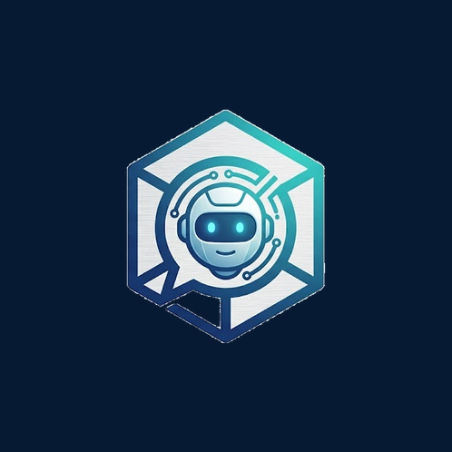

# agentchatbox

<p align="center">
	
</p>

A web chat interface for the [pi coding agent](https://pi.dev). The browser is a thin renderer — the server is a thin transport layer that spawns a `pi --mode rpc` subprocess per WebSocket connection, forwards its events to the browser, and translates client messages into pi RPC commands. The actual agent logic (tools, model routing, system prompt, streaming) lives entirely inside the `pi` subprocess.

- Streaming responses, model picker, thinking levels
- **Steering** — type while the agent is working and your message is queued for the next turn (mirrors the CLI; delivered after the current turn's tool calls finish)
- File / image / voice attachments (image bytes go straight to multimodal models)
- **Agent → you file delivery** — every tool call that touches a `path` (write / edit / read) gets a `⬇ download` link on its card, served from the project dir via `GET /api/file`
- Persistent sessions on disk (`pi` manages JSONL files — survive page reloads and server restarts)
- **Shareable session links** — every chat lives at `/s/<session-id>`. Bookmark it, copy it (`/link` or the Settings menu), or open it on another device to resume the same conversation
- Local TTS (Kokoro, 1.4× playback) and STT (faster-whisper) — no paid cloud APIs
- Slash commands, model switching mid-conversation, session history / resume / rename
- Session list / transcript replay via `/api/sessions`

## Architecture

```
Browser (vanilla DOM, no framework)
  │  WS /api/chat       — bidirectional: init handshake, prompts ↔ pi events
  │  POST /api/upload   — multipart file upload
  │  GET  /api/file    — download a file the agent created (path-contained to piCwd)
  │  POST /api/transcribe — audio → text (Whisper)
  │  POST /api/tts      — text → audio (Kokoro)
  │  GET  /api/models   — list of models with configured API keys
  │  GET  /api/sessions — list pi sessions for the server's cwd
  │  GET  /api/health   — liveness + provider list
  │  GET  /api/changelog — last N commits
  ▼
Node server (this repo) — TRANSPORT LAYER
  │  one `pi --mode rpc` subprocess per session, owned by a session registry
  │  forwards pi stdout NDJSON → browser as {type:"event", event:<line>}
  │  translates client WS messages → pi RPC commands on stdin
  │  session resume: kill child, respawn with --session <id>, replay transcript
  │  detach-on-disconnect: dropping the WS parks the child (does NOT kill it);
  │     a reconnect reattaches to the still-live session, so backgrounding the
  │     tab on Android no longer interrupts in-flight work
  ▼
pi --mode rpc subprocess (the actual coding agent)
  │  tools: bash, read, write, edit, ls, web_search, fetch_content, code_search
  │  writes session JSONL to ~/.pi/agent/sessions/
  │  model routing, system prompt, streaming — all inside pi
  ▼
LLM providers (Anthropic, OpenAI, Google, DeepSeek, MiniMax, …)
```

The server is just a pipe. It owns the WebSocket framing, subprocess lifecycle, session listing/resume (reading pi's JSONL files), and the upload/transcribe/tts HTTP endpoints. The browser never touches provider APIs — API keys live in `.env` and are passed to each `pi` child via `--api-key`.

## Source layout

```
src/
  client/                 # browser-side renderer (bundled to public/app.js)
    main.ts               # boot, send, history, event dispatcher, init handshake
    render.ts             # renderShell + message renderers + status bar
    slashes.ts            # /model, /think, /clear, /sessions, /export, ...
    voice.ts              # TTS playback (1.4×) + MediaRecorder + file attach
    state.ts              # AppState, PromptImage map (no IndexedDB — sessions on disk)
    dom.ts                # $ / el / text helpers, uuid fallback
    ws.ts                 # WebSocket client (init, listSessions, resumeSession, ...)
    api.ts                # REST helpers (upload, transcribe, tts, models, health)
    styles.css
  server/
    index.ts              # Express bootstrap + route mounting
    chat.ts               # WS /api/chat: thin pipe to pi --mode rpc subprocess
    session-registry.ts   # detachable session registry: parks children across
                          #   WS disconnects, reattaches on reconnect, reaps idle
    pi-process.ts         # PiProcess: spawns pi, strict \n NDJSON splitter, kill with SIGTERM→SIGKILL
    session-list.ts       # listPiSessions / readPiSessionMessages (reads pi JSONL files)
    config.ts             # .env → ServerConfig (piBin, piCwd, apiKeys)
    paths.ts              # projectRoot (cwd-independent)
    providers.ts          # SDK_PROVIDERS + KNOWN_PROVIDERS (source of truth for provider list)
    uploads.ts            # /api/upload
    files.ts              # /api/file (download agent-created files, piCwd-contained)
    transcribe.ts         # /api/transcribe (faster-whisper)
    tts.ts                # /api/tts (Kokoro)
    search/               # OPTIONAL pluggable semantic session search
                          #   (see "Semantic session search" below; absent by
                          #   default — delete the folder and the server is
                          #   unchanged)
  shared/
    protocol.ts           # types shared by client and server
tests/                    # vitest, server-side
scripts/                  # build + dev helpers
  build-client.mjs        # esbuild bundler for the client
  _archive/               # throwaway test scripts (gitignored, see .gitignore)
```

## Run locally

Requires Node 20+ and the `pi` CLI on your `$PATH`.

```bash
git clone https://github.com/anunkai1/agentchatbox
cd agentchatbox
npm install
cp .env.example .env
# edit .env to add at least one provider key
npm run dev
```

`npm run dev` runs the server and the client bundler in watch mode — changes to `src/` reload automatically. By default the server listens on `http://0.0.0.0:3000`; set `PORT` in `.env` to change it. The client is served by the server itself (no separate Vite dev server).

## Production build

```bash
npm run build   # bundles client to public/, compiles server to dist/
npm start       # node dist/server/index.js
```

## Environment

Everything goes through `.env`. Keys for the providers you want to use; an empty value means the provider simply isn't shown in the model picker.

| Variable                       | Default                       | Purpose                                        |
|--------------------------------|-------------------------------|------------------------------------------------|
| `PORT`                         | `3000`                        | HTTP port                                      |
| `HOST`                         | `0.0.0.0`                     | Bind address                                   |
| `UPLOADS_DIR`                  | `<root>/uploads`              | Where multipart uploads land                   |
| `MAX_UPLOAD_BYTES`             | `52428800`                    | 50 MB upload cap                               |
| `PI_BIN`                       | `pi`                          | Path to the `pi` CLI binary (overridable for tests) |
| `PI_CWD`                       | `process.cwd()`               | Working directory passed to `pi` as project root |
| `PYTHON_BIN`                   | `python3`                     | Python binary for faster-whisper (STT)           |
| `PI_CODING_AGENT_SESSION_DIR`  | `~/.pi/agent/sessions`        | Where pi stores JSONL session files             |
| `*_API_KEY`                    | (unset)                       | Optional: env keys for non-chat tools (e.g. `VENICE_API_KEY` for pi-venice-image, `GEMINI_API_KEY` for YouTube transcripts). Chat auth itself is NOT configured here — see below. |

Chat-model providers are authenticated via `pi` itself: run `pi auth login <provider>` once and the key is stored in `~/.pi/agent/auth.json`. agentchatbox reads that file live (`getServerApiKey` in `src/server/config.ts`) both to gate the picker and to decide which providers it may spawn a `pi` child for — so logging a provider in or out of `pi` adds or removes it in the UI on the next request, with no ACB restart and no second key store to keep in sync. The spawned `pi` child reads the same `auth.json` directly; ACB does **not** re-inject the key (verified: `pi --mode rpc` authenticates from `auth.json` alone). The `*_API_KEY` env vars above are therefore only for extensions/tools that need a key ACB doesn't pass on, not for chat auth. Only providers present in `auth.json` are exposed via `/api/models`.

## Endpoints

| Method | Path                  | Purpose                                                |
|--------|-----------------------|--------------------------------------------------------|
| POST   | `/api/upload`         | Multipart file upload                                  |
| GET    | `/uploads/:filename`  | Download a previously uploaded file                    |
| DELETE | `/uploads/:filename`  | Remove an upload                                       |
| POST   | `/api/transcribe`     | Audio → text (faster-whisper)                          |
| POST   | `/api/tts`            | Text → audio (Kokoro)                                  |
| GET    | `/api/health`         | `{ status, commit, providers, whisper, tts, ttsVoice }` |
| GET    | `/api/models`         | List of available models (only configured providers)   |
| GET    | `/api/sessions`       | List pi sessions for the server's cwd (`?cwd=<path>`)  |
| GET    | `/api/sessions/:id`   | Full message transcript for a session                  |
| GET    | `/api/changelog?limit=N` | Last N git commits, for `/changelog` slash command  |
| WS     | `/api/chat`           | The main channel — see below                           |
| GET    | `/`                   | Built web UI                                           |

### WebSocket protocol (`/api/chat`)

One connection per session. The client must send `init` as its first message; the server spawns a `pi --mode rpc` child, waits for its session id via `get_state` polling, then sends `ready`. From then on, every pi event is forwarded as a JSON frame.

```ts
// client → server
{ type: "init", provider, modelId, thinkingLevel, sessionId? }  // FIRST message — spawns pi child
{ type: "prompt", text: string, images?: PromptImage[] }
{ type: "abort" }
{ type: "setModel", modelId: string, provider: string }
{ type: "setThinking", level: ThinkingLevel }
{ type: "listSessions" }
{ type: "newSession" }          // kill child, spawn fresh
{ type: "resumeSession", sessionId: string }  // kill child, respawn with --session <id>
{ type: "renameSession", name: string }

// server → client
{ type: "ready", modelId, provider, thinkingLevel, sessionId }  // child spawned, ready for prompts
{ type: "event", event: <piRpcLine> }      // every NDJSON line from pi stdout, verbatim
{ type: "sessions", sessions: SessionSummary[] }  // response to listSessions
{ type: "transcript", sessionId, messages: Message[] }  // prior transcript on resume
{ type: "sessionResumed", sessionId, modelId, provider, thinkingLevel }
{ type: "error", message: string }
```

The `event` frames are whatever `pi --mode rpc` emits on stdout — the same event stream the TUI would see (`message_update` for streaming tokens, `tool_execution_start`/`end`, `agent_end`, etc.). The client's renderer handles the full `pi` event surface; unknown types are ignored.

**Session lifecycle:** `newSession` kills the current child and spawns a fresh one (no `--session`). `resumeSession` kills the current child, spawns with `--session <id>`, and replays the prior transcript (read from disk) as a `transcript` message before live events flow. The WS is NOT closed during respawn — the client gets a new `ready` when the new child comes up.

**Disconnect = detach, not kill.** When the WS drops (Android backgrounding the tab, locking the phone, a network blip), the server does **not** kill the `pi` child. The session registry parks it and keeps it running, so in-flight work is not interrupted. When the browser reconnects and sends `init` with the same `sessionId`, the server reattaches to the still-live child, replays the on-disk transcript, and — if the agent is mid-turn — replays the buffered current-turn events so the streaming UI reconstructs exactly. A parked session is only reaped after it has gone idle (its turn ended) **and** stayed unattached past a grace period (`AGENTCHATBOX_IDLE_GRACE_MS`, default 5 minutes); a session mid-turn is never reaped. This is the mobile-robustness fix — it makes the agent survive a phone lock the way a `tmux` session survives closing a terminal.

## Run as a system service

Example `/etc/systemd/system/agentchatbox.service`:

```ini
[Unit]
Description=agentchatbox
After=network.target

[Service]
Type=simple
User=architect
WorkingDirectory=/home/architect/agentchatbox
EnvironmentFile=/home/architect/agentchatbox/.env
ExecStart=/usr/bin/node /home/architect/agentchatbox/dist/server/index.js
Restart=on-failure
RestartSec=5

[Install]
WantedBy=multi-user.target
```

```bash
sudo systemctl daemon-reload
sudo systemctl enable --now agentchatbox
```

## Testing

```bash
npm test          # vitest run (server-side unit + integration)
npm run typecheck # tsc, both server and client configs
npm run build     # full production build
```

CI runs all three on push to `main` and on PRs. Tests live in `tests/`.

## Why a subprocess architecture?

The original prototype ran the agent in-process (Node-side Agent factory with local tools). That worked, but coupling the agent lifecycle to the web server meant:

1. **Tool dependencies leaked into the server.** Every tool (bash, web access, file ops) was server code that had to be maintained, tested, and kept compatible with the agent SDK — duplicating what `pi` already does natively.
2. **Agent crashes took down the server.** An unhandled error in the agent loop killed the whole process, including unrelated connections.

The current model is simpler: the server spawns `pi --mode rpc` per connection, forwards its stdout to the browser, and translates client messages into pi RPC commands on stdin. The server is just a pipe — the actual agent logic (tools, model routing, streaming, system prompt) lives inside `pi`, where it belongs. If a child crashes, only that WS connection sees it; the server and other connections are unaffected.

## Semantic session search (optional)

The sidebar can optionally show a **search-by-meaning** box. Type a memory in
your own words ("I moved MavalETH from server 3 to server 2") and it returns
the sessions/messages whose meaning is closest — even if no words overlap.

This is a **pluggable, opt-in feature**. It is invisible and imposes zero cost
until you explicitly enable it, and it can be removed without touching the rest
of the app.

### How it works

- Every session's messages are embedded with a small local model
  (`all-MiniLM-L6-v2`, 30 MB, 384-dim) via `@huggingface/transformers`. No API
  key, no network at runtime — the model downloads once to
  `~/.cache/huggingface/`.
- Vectors persist in a SQLite file (`data/search.db`) and are loaded into RAM
  as one contiguous `Float32Array`; search is a brute-force cosine match, ~15 MB
  per 10k messages and sub-100 ms per query. No database server.
- Indexing is **mtime-driven**: only new or changed session JSONL files are
  re-embedded. It reads the same files `pi` already writes (like
  `session-list.ts` does) — no `pi` subprocess involvement, no agent logic.

### Enabling

It needs two optional packages (declared in `optionalDependencies`, so
a build failure on some platform can't break the core server — and the
search module degrades to `off` if either is missing). Install/reinstall them
explicitly to enable:

```bash
npm install better-sqlite3 @huggingface/transformers
```

then in `.env`:

```
AGENTCHATBOX_SEARCH_ENABLED=1
```

Restart the server. `/api/health` now reports `search: true`, the sidebar
shows a search box, and `GET /api/sessions/search?q=<your memory>` returns
ranked hits.

### Disabling / removing

- **Disable:** unset `AGENTCHATBOX_SEARCH_ENABLED`. The box disappears,
  `/api/sessions/search` returns 404. The index file stays on disk.
- **Remove entirely:** `rm -rf src/server/search`, uninstall the two packages.
  Because the core server references the module only via two non-literal
dynamic
  imports (in `/api/health` and the endpoint handler), deleting the folder
  leaves the server compiling and running identically. No other file needs
  editing.

Design ported from [Resonant](https://github.com/codependentai/resonant), whose
approach is proven in production for exactly this case. See
`src/server/search/`.

## Related

### Runtime dependencies

agentchatbox's voice stack is split across two sibling services — together
they decide *what* to say (pi-voice-reply) and *how* to say it (pi-voice-server):

- [pi-voice-server](https://github.com/anunkai1/pi-voice-server) — minimal **Kokoro-82M** TTS HTTP server. `/api/tts` and `/api/tts/stream` proxy here for actual speech synthesis (loads one model, keeps it warm, serializes calls, streams chunks so playback starts before synthesis finishes).
- [pi-voice-reply](https://github.com/anunkai1/pi-voice-reply) — `pi` extension producing spoken-summary voice replies (long listenable + short concise rewrites via the same model that produced the reply). Triggered by "reply in voice" phrases or the `/voice` command.

### Upstream

- [pi](https://pi.dev) — the coding agent
- [`@earendil-works/pi-ai`](https://github.com/earendil-works/pi) — unified LLM API
- [`@earendil-works/pi-agent-core`](https://github.com/earendil-works/pi) — agent loop
- [`@earendil-works/pi-web-ui`](https://github.com/earendil-works/pi) — the upstream project this UI is inspired by. We don't use its components (vanilla DOM, no framework) but its bundled stylesheet (`app.css`, Tailwind v4 + KaTeX) is copied into `public/app.css` at build time.

## License

MIT
